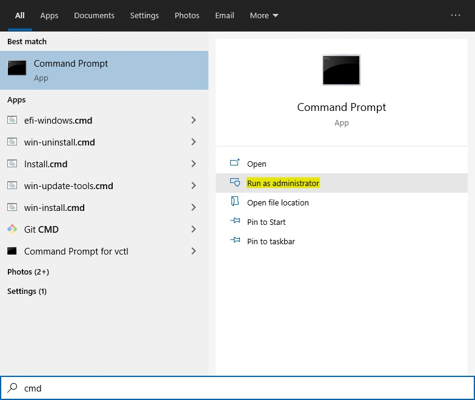
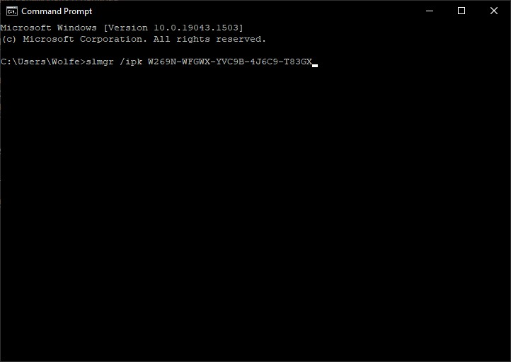
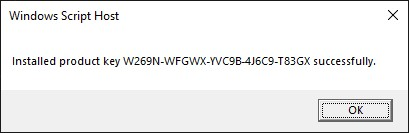
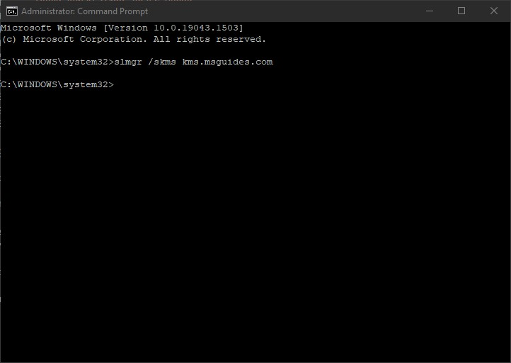
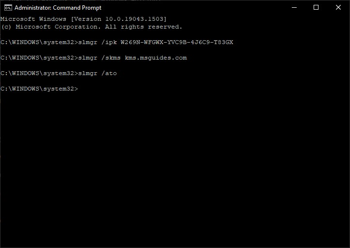
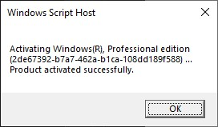
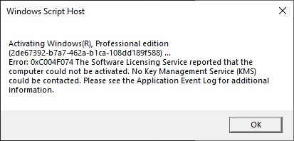
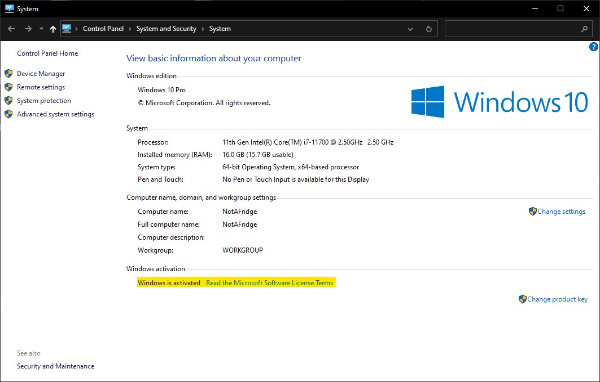
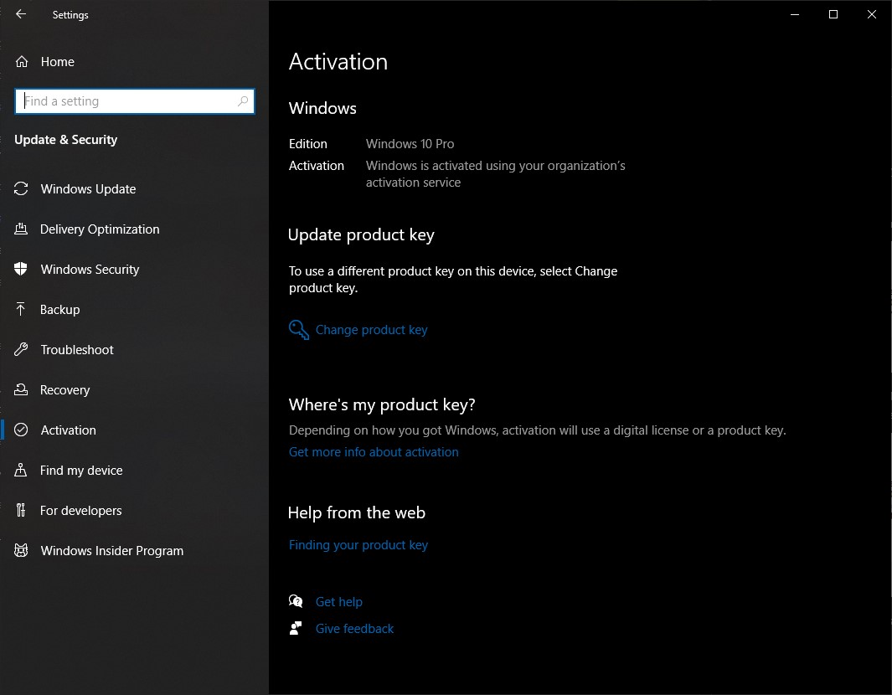

## Activate Windows 10

Just a quick story. 

A few months back I have upgraded the CPU and motherboard in my computer. After I booted back into Windows, installed all the necessary drivers and got internet connection back... Microsoft gave me the middle finger. I tried all the possible ways to recover the license, but no luck. The only way was to buy another license, but after what they've done I wouldn't give them my money again. Just for this to happen again in a few years time when I upgrade again.

### Open Command Prompt as administrator.

Click on the start button, search for `cmd` then run it with administrator rights.

### Install KMS client key

Use the command `slmgr /ipk yourlicensekey` to install a license key (yourlicensekey is the activation key that corresponds to your Windows edition). 

Windows 10 Volume license keys:

* Home: `TX9XD-98N7V-6WMQ6-BX7FG-H8Q99`
* Home N: `3KHY7-WNT83-DGQKR-F7HPR-844BM`
* Home Single Language: `7HNRX-D7KGG-3K4RQ-4WPJ4-YTDFH`
* Home Country Specific: `PVMJN-6DFY6-9CCP6-7BKTT-D3WVR`
* Professional: `W269N-WFGWX-YVC9B-4J6C9-T83GX`
* Professional N: `MH37W-N47XK-V7XM9-C7227-GCQG9`
* Education: `NW6C2-QMPVW-D7KKK-3GKT6-VCFB2`
* Education N: `2WH4N-8QGBV-H22JP-CT43Q-MDWWJ`
* Enterprise: `NPPR9-FWDCX-D2C8J-H872K-2YT43`
* Enterprise N: `DPH2V-TTNVB-4X9Q3-TJR4H-KHJW4`

### Set KMS machine address

Use the command `slmgr /skms s8.uk.to` or `slmgr /skms kms.msguides.com` to connect to the KMS server.

### Activate Windows

The last step is to activate your Windows using the command `slmgr /ato`.

If the activation works, you should see:

If you see the error 0xC004F074, it means that your internet connection is unstable or the server is busy. Please make sure your device is online and try the command “ato” again until you succeed.

Now check the activation status again.

Windows 10 is activated successfully

There is also a script method on the original website, but I found that to no longer be working.

Sources: [msguides.com](https://msguides.com/windows-10))