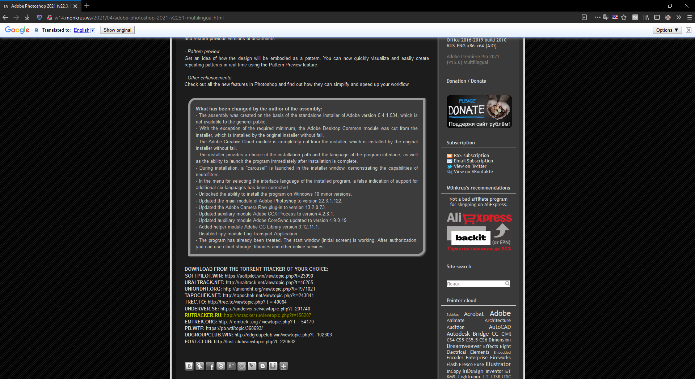
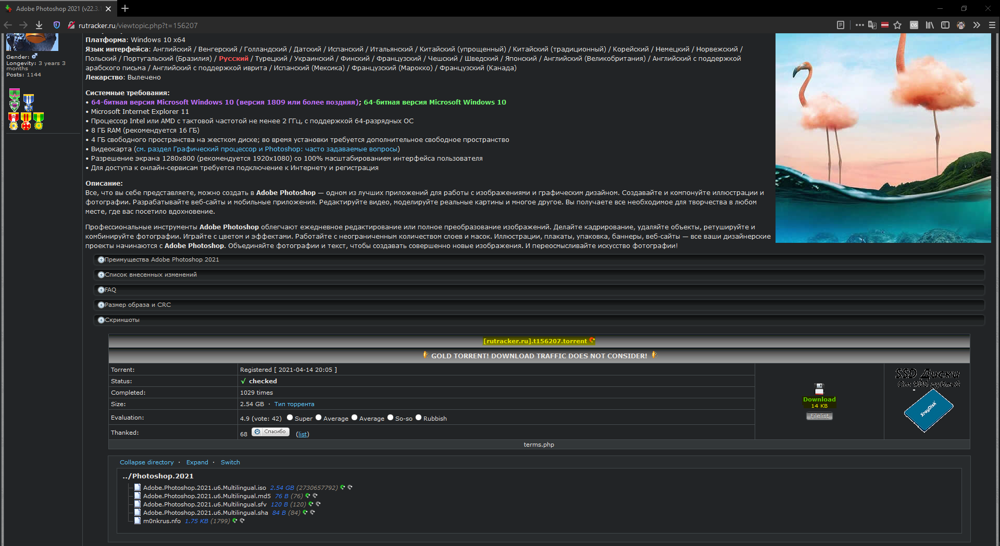

## Adobe Cloud Pre-Activated

Use torrent to download the latest versions.

### Torrent download:
* [www.monkrus.ws](http://www.monkrus.ws) 

Visit the monkrus official website (he is the person that cracked Adobe)

In the download section, choose `rutracker`. It is the **most reliable tracker** offered and it has the highest download speed.

You will have to register an account on `rutracker` before you can download.

A torrent client will be required. If you don't have one, I recommend getting `qbittorrent` (Open source torrenting client)

After you register, you will be able to see the torrent file and magnet link.

Download it as you would normally do with a torrent.

For installation check out [this](https://telegra.ph/Guide-of-Installation-05-19) guide

### Older versions:
* [telegra.ph](https://telegra.ph/Older-adobe-cc-2020-and-2019-versions-04-03)
* [Google Docs](https://docs.google.com/document/d/1bwf8fa0IBM5fbUkM_0_PnWqR9HXYn-3_PlnavywaiUo/view)

Due to the fact that Google is breaking team drives (and RFS slowly dying), download links will stop working. For archival proposes the old version of this post is available [here](/posts/legacy/adobeCloud.md)

Sources: [telegra.ph](https://telegra.ph/How-to-download-latest-adobe-cc-2020-ISO-in-Google-Drive-04-18), [Google Docs](https://docs.google.com/document/d/1_Me1TQzXqCYASls7P5Zt5mASNsPamyNVnZfu48t_5Yw/edit?usp=drivesdk)