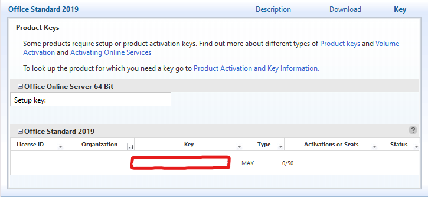
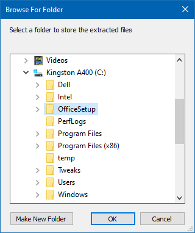
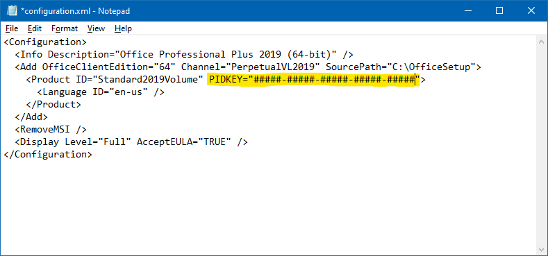
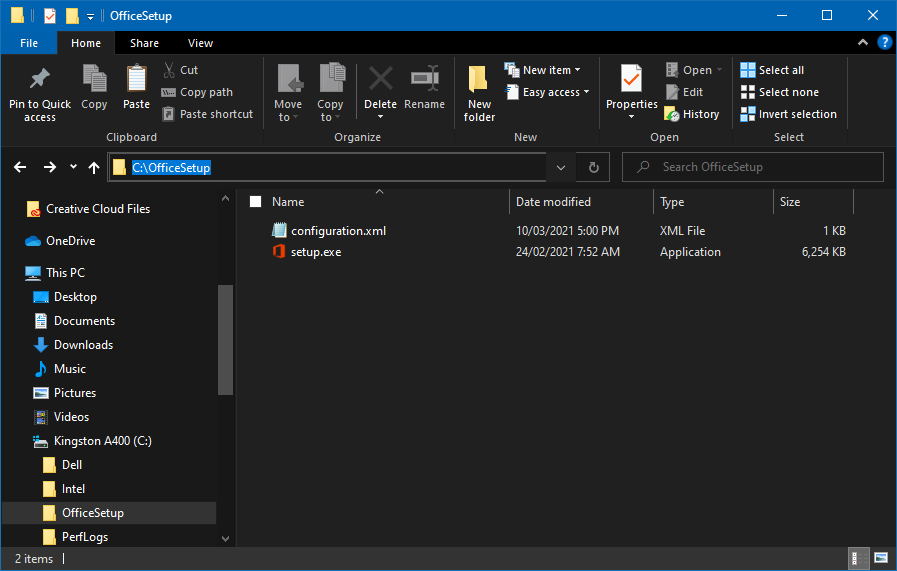
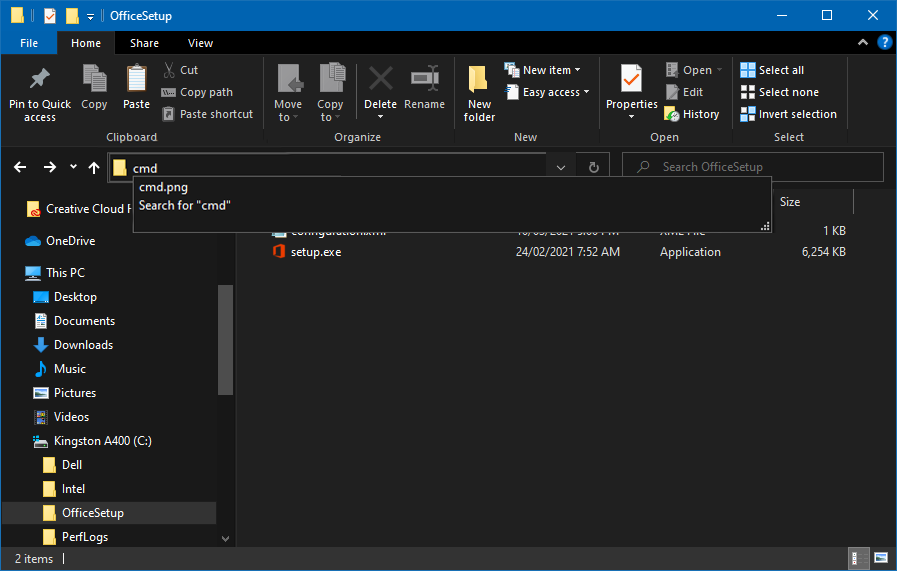
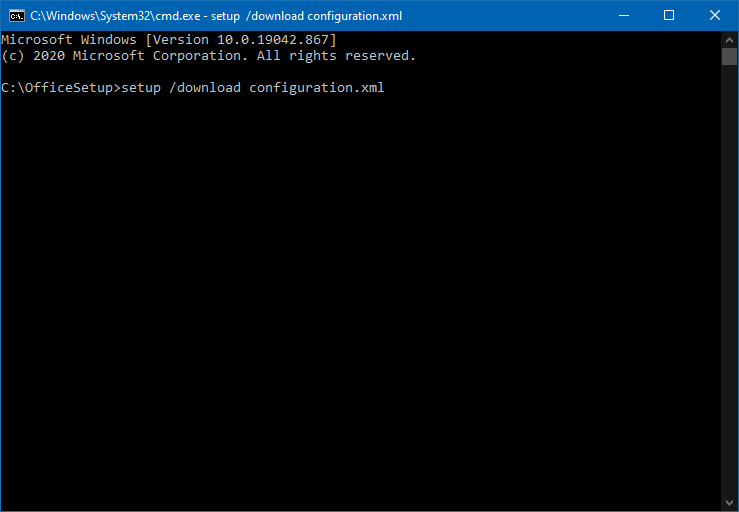

## Deploy Office 2019 VLSC

Before starting off, this is a guide on how to install Office 2019 using Volume Licensing Service, I'm assuming you already have a VLSC ready account. All the keys provided in this guide are taken from official microsoft sources.

### Get Your Office 2019 Product Key from the VLSC

1. Sign in to the VLSC.
1. Find your Office 2019 product in the list and get it's Key.
1. In the table beneath the name of the product, find your product key in the column labeled Key. The Type column for this key should say MAK, not KMS.

> Office suites have separate setup keys for online functionality like web apps. These keys are not the same as the MAK product keys and cannot be used for volume activation of desktop products. 



### Download the Office Deployment Tool (ODT)

1. Download the [Office Deployment Tool](https://www.microsoft.com/en-us/download/details.aspx?id=49117) from Microsoft.
1. After it's done downloading, open it and accept the terms of service that you 100% will read.
1. You will be asked to choose a folder to store the extracted setup files. Navigate to the root level of your computer's hard drive (C:) and click `Make New Folder`. Then, name the folder `OfficeSetup` and continue with the extraction process. Note that these instructions won't work if you choose a different folder name or location. 



4. When you are finished, your new `OfficeSetup` folder should have a file named `setup.exe` and some sample `configuration.xml` files. Delete the configuration files. You only need to keep the setup file.

### Prepare the Configuration File

Once you have a copy of the ODT, you need to create a configuration.xml file.

```xml
<Configuration>
  <Add SourcePath="C:\OfficeSetup" OfficeClientEdition="64" Channel="PerpetualVL2019">
      <Product ID="ProPlus2019Volume"  PIDKEY="#####-#####-#####-#####-#####" >
         <Language ID="en-us" />
      </Product>
      <Product ID="ProofingTools">
      </Product>
  </Add>
  <RemoveMSI />
  <Display Level="None" AcceptEULA="TRUE" />  
</Configuration>
```

Refer to [this guide](https://docs.microsoft.com/en-us/deployoffice/office2019/deploy#create-the-configurationxml) for the `Product ID` and any other attributes. Or you can use these pre-configured files:

| Office Suites                          | Project                       | Visio                            |
|----------------------------------------|-------------------------------|----------------------------------|
| [Office Standard 2019 (32-bit)](./assets/deployOffice2019/configuration-project-standard-2019-32-bit.xml)          | [Visio Standard 2019 (32-bit)](./assets/deployOffice2019/configuration-visio-standard-2019-32-bit.xml)    | [Visio Standard 2019 (32-bit)](./assets/deployOffice2019//configuration-visio-standard-2019-32-bit.xml)
| [Office Standard 2019 (64-bit)](./assets/deployOffice2019/configuration-office-standard-2019-64-bit.xml)          | [Project 2019 (64-bit)](./assets/deployOffice2019/configuration-project-standard-2019-64-bit.xml)         | [Visio Standard 2019 (64-bit)](./assets/deployOffice2019/configuration-visio-standard-2019-64-bit.xml)     |
| [Office Professional Plus 2019 (32-bit)](./assets/deployOffice2019/configuration-office-professional-plus-2019-32-bit.xml) | [Project Professional (32-bit)](./assets/deployOffice2019/configuration-project-professional-2019-32-bit.xml) | [Visio Professional 2019 (32-bit)](./assets/deployOffice2019/configuration-visio-professional-2019-32-bit.xml) |
| [Office Professional Plus 2019 (64-bit)](./assets/deployOffice2019/configuration-office-professional-plus-2019-64-bit.xml) | [Project Professional (64-bit)](./assets/deployOffice2019/configuration-project-professional-2019-64-bit.xml) | [Visio Professional 2019 (64-bit)](./assets/deployOffice2019/configuration-visio-professional-2019-64-bit.xml) |

1. Next, follow the instructions below to add the product key that you obtained from the VLSC to the configuration file.

1. Edit the configuration file, Look for the following string of text in the configuration file: `PIDKEY="#####-#####-#####-#####-#####"` 



3.  replace `#####-#####-#####-#####-#####` with your MAK client activation key by copying and pasting the key from wherever you saved it. Or use the GVLK keys provided by microsoft [here](https://docs.microsoft.com/en-us/DeployOffice/vlactivation/gvlks) (note this will not fully active the software, just allow you to install it)

4. Rename the configuration file, and change the filename to be `configuration.xml`.

>If the configuration file you downloaded has a name that ends with `.xml`, that means your installation of Windows has been set to display file extensions. If this is the case, make sure to keep `.xml` in your filename by renaming it as `configuration.xml` instead of `configuration`.

### Download and Install Your Product

Note that all earlier versions of Office will be uninstalled when you install Office 2019 products, so be sure to save and quit any Office applications that are running.

1. Navigate to your "OfficeSetup" folder in File Explorer.
1. Open the Command Prompt, click the address bar in the File Explorer window that you opened and type `cmd`. 




3. Type the following `setup /download configuration.xml` into the Command Prompt that you opened.



It will look as if nothing is happening, but your product will be downloading in the background. The download will be about 4GB in total and might take a while to finish.

4. When the download has finished, you're ready to install the product, run the following command `setup /configure configuration.xml`. If you see an error that says you still have previous versions of Office installed on your computer, you'll need to manually uninstall those programs and run the above command again.

And, you're done! You an now start enjoying the installed product.

Sources: [techsoup.org](https://www.techsoup.org/support/articles-and-how-tos/how-to-download-and-install-microsoft-office-2019-products-requested-from-techsoup), [Microsoft](https://docs.microsoft.com/en-us/deployoffice/office2019/deploy)/[Keys](https://docs.microsoft.com/en-us/DeployOffice/vlactivation/gvlks)