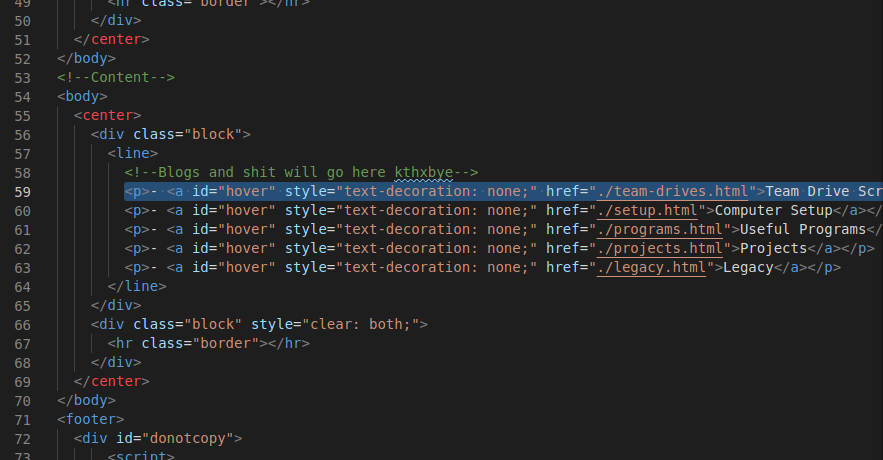
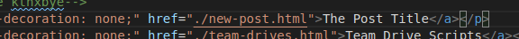
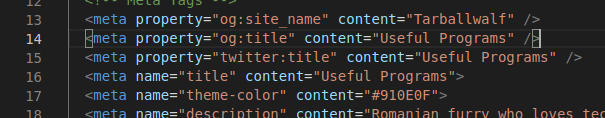
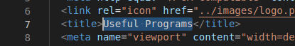
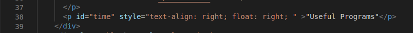
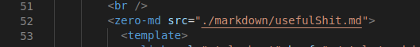

## How to create posts on my website
##### This is not for the public. I've created this in case if I happen to forget.

1. Create a new `name.html` file in the `projects` directory.
2. Add it to the `index.html` by creating a new line (copy pasting the one below).

And modify the file path and name of the "post".

3. Use `programs.html` as a template for the code (i'm sure nobody re-wries code for every single new page).
4. Modify `line 14, 15 and 16` with the post title.

5. Modify `line 7`...

 ...and `line 38` with the post title.
 

6. Create the Markdown file (.md file) in the `markdown` directory.
7. Go back to your "post" and edit `line 52` adding the markdown file.

8. Create the "post" in the markdown file and you're done. Don't forget to commit and push the changes.

Links: [Mastering Markdown](https://guides.github.com/features/mastering-markdown/), [Adding images into markdown](https://www.codegrepper.com/code-examples/html/add+image+in+markdown+github)